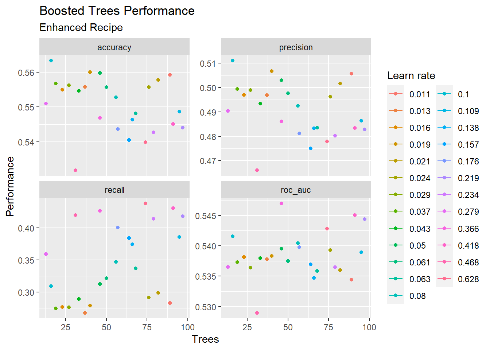

# Introduction

## Brief problem statement

This analysis aims to use historical return, volume from NASDAQ index during 2015-2019 to predict whether the NASDAQ will be up or down.

## Assessing the models - explain your uses of performance metrics, cross-validation settings, splitting proportions and any stratification.

**Performance Metrics**

The metrics that were calculated were (ROC_AUC, accuracy, precision, recall). ROC_AUC was determined to be the optimization metric as it is designed for classification purposes. It shows the performance of the model at identifying if the model is positive or negative.

**Cross-validation**

The data is folded 10 times and the process is repeated 3 times. Folding is a process of resampling method that divides the training data into a certain amount of groups (in our case 10) and fits 9 of them for the model and 1 for computing the performance. The 3 repetitions indicates the number of time of this process is ran to avoid outliers/ test errors.

**Data Splitting and Stratification**`prop=0.75` and `strata=Up_Down`were the parameters used in splitting the data. `prop=0.75` puts 75% into training (`data_train`) and 25% into `data_test`. `strata=Up_Down`is used to stratified random sample the data to ensure the data in each of the divided dataset is not over represented as the EDA analysis showed being more up days than down.

## Process and findings from exploratory data analysis

**Process**

1.  Checked for missing data using the code below which returned 0 as all data were in the dataset

    `sum(is.na(data))`

    `sum(duplicated(data))`

2.  Ran Descriptive Statistic for Up and Down days for NASDAQ

3.  Replicate the previous step but on a yearly basis to see how the performance yearly have been

4.  Create Pairs Plot to understand relationship between variables

**Findings/Insights**

-   From the Pairs plot it can be seen the overall days that the market was up is greater than the day is was down over the last 10 year this could potentially impact our model as the market condition today are not the same as the one used to train the model

-   All numerical variables seems to have little to no correlation given they are all close to 0. The variables that have the highest correlation (negative) are volume with the returns from previous 1-5 days but they still present at most -0.08 which is really weak

-   Previous day Returns (Lag_1) typically range anywhere from -7% to 6% if the market is up, when down the range is only -5% to 5%. There also seems to be slightly more volume on days the market is down possibly due to investors selling after seeing others sells

## Executive summary of your conclusions from these experiments

-   Based on all the models ran (boosting, random forest, RBF SVM, Polynomial SVM and neural network), volume seems to be the most important indicator. This can be rationalize through if the volume is high there are alot of interest in the market and based off of EDA there were more up days overall.

-   All model are currently not suitable for use and more variables could potentially make the model more accurate and relevant. Based on the metrics that are outputted via ROC_AUC it was seen to be around \~0.5 which is less than 0.6 and considered poor.

-   Past returns are not indicative of future prospect so having most variable as lagging returns ranging from 1-5 days ago creates an unusable model

-   Would not recommend formulating strategy around model or this dataset for the reasons mentioned above and the poor performance

# Results from evaluating models

## For each experiment, include a subsection that contains the most important results:

## Boosting

> ### The best-performing recipe (Enhanced)
>
>     boost_base_recipe<-
>       recipe(Up_Down~ ., data = data_train)%>%
>       step_zv(all_numeric(), -all_outcomes()) %>%
>       step_corr(all_numeric(), -all_outcomes())
>       
>     boost_enhanced_recipe <- 
>       boost_base_recipe%>%
>       step_bs(-Up_Down)
>
> ### The hyperparameter testing and performance (e.g., with a data visualization)
>
> 
>
> ### The best-performing configuration of hyperparameters
>
>     best_enhanced_model<-    
>         boost_tree(trees = 46,
>               learn_rate = 0.366) %>%
>         set_mode(('classification')) %>%
>         set_engine('xgboost')

### Random Forest

> ### The best-performing recipe (Enhanced)
>
>     boost_base_recipe<-
>       recipe(Up_Down~ ., data = data_train)%>%
>       step_zv(all_numeric(), -all_outcomes()) %>%
>       step_corr(all_numeric(), -all_outcomes())
>       
>     boost_enhanced_recipe <- 
>       boost_base_recipe%>%
>       step_bs(-Up_Down)
>
> ### The hyperparameter testing and performance (e.g., with a data visualization)
>
> 
>
> ### The best-performing configuration of hyperparameters
>
>     best_enhanced_model<-    
>         rand_forest(trees = 100,
>               mtry = 3) %>%
>         set_mode(('classification')) %>%
>         set_engine('ranger', importance = "impurity")

## **Polynomial SVM**

> ### The best-performing recipe (Base)
>
>     polysvm_base_recipe<-
>       recipe(Up_Down~ ., data = data_train)%>%
>       step_zv(all_numeric_predictors(), -all_outcomes()) %>%
>       step_normalize(all_numeric_predictors(), -all_outcomes()) %>%
>       step_YeoJohnson(all_numeric_predictors(), -all_outcomes())%>%
>       step_corr(all_numeric_predictors(), -all_outcomes())
>
> ### The hyperparameter testing and performance (e.g., with a data visualization)
>
> 
>
> 
>
> ### The best-performing configuration of hyperparameters
>
>     best_base_model<-    
>         svm_poly(cost = 14.065,
>               degree =  2,
>               scale_factor= 0.047,
>               margin=0.139) %>%
>         set_mode(('classification')) %>%
>         set_engine('kernlab',importance = "impurity")

## RBF SVM

> ### The best-performing recipe (Base)
>
>     rbfsvm_base_recipe<-
>       recipe(Up_Down~ ., data = data_train)%>%
>       step_zv(all_numeric_predictors(), -all_outcomes()) %>%
>       step_normalize(all_numeric_predictors(), -all_outcomes()) %>%
>       step_YeoJohnson(all_numeric_predictors(), -all_outcomes())%>%
>       step_corr(all_numeric_predictors(), -all_outcomes())
>
> ### The hyperparameter testing and performance (e.g., with a data visualization)
>
> 
>
> ### The best-performing configuration of hyperparameters
>
>     best_base_model<-    
>         svm_rbf(cost = 2.652,
>                 rbf_sigma = 0.004) %>%
>         set_mode(('classification')) %>%
>         set_engine('kernlab',importance = "impurity")

## Neural Networks

> ### The best-performing recipe (Enhanced)
>
>     neuralnetworks_base_recipe<-
>       recipe(Up_Down~ ., data = data_train)%>%
>       step_zv(all_numeric_predictors(), -all_outcomes()) %>%
>       step_normalize(all_numeric_predictors(), -all_outcomes()) %>%
>       step_YeoJohnson(all_numeric_predictors(), -all_outcomes())%>%
>       step_corr(all_numeric_predictors(), -all_outcomes())
>       
>     neuralnetworks_enhanced_recipe <- 
>      neuralnetworks_base_recipe%>%
>       step_bs(-Up_Down)
>
> ### The hyperparameter testing and performance (e.g., with a data visualization)
>
> 
>
> ### The best-performing configuration of hyperparameters
>
>     best_enhanced_model<-    
>         mlp(hidden_units = 9,
>               penalty = 0.101) %>%
>         set_mode(('classification')) %>%
>         set_engine('nnet',importance = "impurity")

# Testing the final model

## From among the models discussed in the report section above, choose the best-performing model

The best model with each experiment was consolidated into a table below and based on the optimization metric of ROC_AUC Polynomial SVM has the best performance.

+--------------------+-----------+--------------------------+-----------------------+----------+
| Experiment         | ROC_AUC   | Parameters               | Configuration         | Recipe   |
+====================+===========+==========================+=======================+==========+
| Boosting           | 0.547     |     trees = 46,          | Preprocessor1_Model22 | Enhanced |
|                    |           |     learn_rate = 0.366   |                       |          |
+--------------------+-----------+--------------------------+-----------------------+----------+
| Random Forest      | 0.557     |     trees = 100,         | Preprocessor1_Model70 | Enhanced |
|                    |           |     mtry = 3             |                       |          |
+--------------------+-----------+--------------------------+-----------------------+----------+
| **Polynomial SVM** | **0.586** |     cost = 14.065,       | **Iter12**            | **Base** |
|                    |           |     degree =  2,         |                       |          |
|                    |           |     scale_factor= 0.047, |                       |          |
|                    |           |     margin=0.139         |                       |          |
+--------------------+-----------+--------------------------+-----------------------+----------+
| RBF SVM            | 0.566     |     cost = 2.652,        | Preprocessor1_Model02 | Base     |
|                    |           |     rbf_sigma = 0.004    |                       |          |
+--------------------+-----------+--------------------------+-----------------------+----------+
| Neural Networks    | 0.579     |     hidden_units = 9,    | Preprocessor1_Model09 | Enhanced |
|                    |           |     penalty = 0.101      |                       |          |
+--------------------+-----------+--------------------------+-----------------------+----------+

## Using your chosen model, evaluate performance using the test data

```{r, warning=FALSE,message=FALSE}
library(dplyr)
library(tidymodels)
load(file = 'polysvm_base_objects.Rda')
load(file = 'data_split.Rda')
```

```{r}
best_base_fit<-
  best_base_wf%>%
  last_fit(data_split)

best_base_fit$.metrics[[1]]
```

## Report and discuss the results of this final model evaluation

When fitting the testing data to the model it is seen that the ROC_AUC (the optimization metric) is greater than what was retrieved in when applying the training data. This is not suppose to happen as the data should perform better based on what it is trained on. A few possibility that has caused/ can resolve this problem

1.  The seed that was used for splitting the data just happened to split points favourably toward the model allocating easier points to fit in the testing set

2.  The data points used for this analysis was limited and with a bigger dataset this problem could be resolved

3.  More cross validation folds may be needed to mix up and randomize the data points more

In addition when looking at the confusion matrix generated in the working papers it can be seen false positive and false negative make up a sizable amount which is not good as those would be scenarios where we buy thinking it will increase but then it decrease or vice versa.

|                  | Up (Predictions) | Down (Predictions) |
|------------------|------------------|--------------------|
| **Up (Truth)**   | 427              | 81                 |
| **Down (Truth)** | 319              | 92                 |

# Conclusion

## Considering your final model, would you recommend it to management as the basis of a trading strategy? What would be the strengths and weaknesses of such a strategy?

Ignoring the issue raised above given the AUC_ROC is only \~0.60, it is very clear that this is not a good model as it can only correctly predict up or down day 60% of the time. The odds are only slightly better than flipping a coin. In addition the data used was from 2015 - 2019 where the NASDAQ was producing extraordinary returns and investors were willing to pay premium for technology related stocks that have not proven their valuation. This is completely different from the market environment we are currently experiencing in 2022 and going forward due to the rise in interest rate and cost of borrowing increasing / investors unwillingness to take risks.

## How would you implement this kind of strategy, focusing on either long or short positions on the Nasdaq?

If a strategy had to be implemented using this model and assuming markets are still somewhat similar to 2015-2019. A short term trading strategy could be formulated around Monday as the feature importance chart shows Volume being the most important feature in the model. Monday is usually when markets experience the most volume due to coming off 2 day break from the weekends so a higher volume can be achieved. In this strategy the buying would ideally happen on Friday prior to market close or pre-market trading Monday and sold by 10am on Monday as that is when volume falls off. The only concern would be the market does not necessarily act rationally as in the short time frame it acts more like a voting machine due to investor psychology and panic selling so the firm may be left holding onto what it bought if a drastic panic sell occurs or it would need to get out at a slight loss to prevent further losses.


