## Introduction

**Problem statement:** Whether it is possible to accurately predict if a customer is going to default based on the information we have including past bill and payment history, gender, level of education and etc

**Project objective:** Using information we have about our customer using different machine learning models to predict whether customers will default

**Overview of report sections**

In the report below content is split into 5 sections:

-   Methodology - Considerations that went into how to model the data

-   Data - Investigation of the data itself to gain a better understanding prior to applying models to it

-   Model - Three models were applied based on the characteristics of baseline, low complexity and best performing

-   Test Results - Interpretation of the result from the models above

-   Conclusion - Linking the test results from prior section to a business insight

**Executive summary of model recommendations**

Based on the analysis below it can be seen using the neural networks model generates the best results but also uses the most time. It should be discussed with the key stakeholder to see how significant it is to achieve the greatest performance as the baseline model provided a result that is a bit lower than best performing but runs very efficiently.

## Methodology

**Model Selection**

When selecting the models to fit the data onto the main concern was the computation time due to machinery being used and the size of the dataset compared to what was used in the past. All model chosen aimed to bring down computation time while not sacrificing too much performance. Knowing the question we are investigating is a classification one (if `is_default`will be yes/no) Four models were shortlisted as they were made for classification problems.

1.  Logistic Regression

2.  Decision Tree

3.  Random Forest

4.  Neural Networks

All of them were tested but Random Forest had a runtime that was significantly greater than the other model so it was omitted leaving three model. Neural Network provided the best performance while logistic regression ran the fastest and decision tree fell in between expect for its performance which was weaker than logistic regression. This was a rare occasion as it is usually suppose to perform better.

**Tuning Process**

The tuning process mainly consisted of Latin hypercubes in the first round and a regular grid to narrow down the range in the second round based on what the best performing model were determined by the result of latin hypercube. Latin hypercube were employed due to its ability to provide random values and a a regular was then used for simplicity

**Performance Metrics**

Due to the question we are investigating being a classification question (results in Yes/No). The following metrics were collected if available. ROC_AUC, accuracy, recall and precision. ROC_AUC was the metric used for optimizing the models as it is designed to be used on classification and show how well the model is able to distinguish between the two outcomes (Yes/No for `is_default`)

**Data Splits and Re-sampling**

When splitting the data I put 75% into training and 25% into testing. The data was split keeping in mind of 3:1 ratio for every three training point there will be a testing point. This is crucial as allocating too much data to training would cause an overfit and cause the testing data to not perform well while too little allocation would under train the model and cause the test data to perform bad as well. 75% allocation was chosen as it was the middle ground between 100% and 50% of allocation. The seed used was `set.seed(703412697)`

{width="455"}

For re-sampling a cross validation nethod was applied. Folds was set at default of 10 and a repeat of 3 was used. The trade off between setting folds to a lower value is achieving a faster computation but less resampling will be done as less groups will be created. Repeat of 3 was set due to a high fold number which creates different various different grouping so it was determined 3 repeats was enough keeping in mind of limited computational power. The seed used was `set.seed(64749068)`

{width="447"}

**Feature engineering**

The preprocessing step taken for each model was different and followed what was recommended by [Tidy Modeling with R](https://www.tmwr.org/pre-proc-table.html). The steps for each of the model used can be seen highlighted in the photo below.

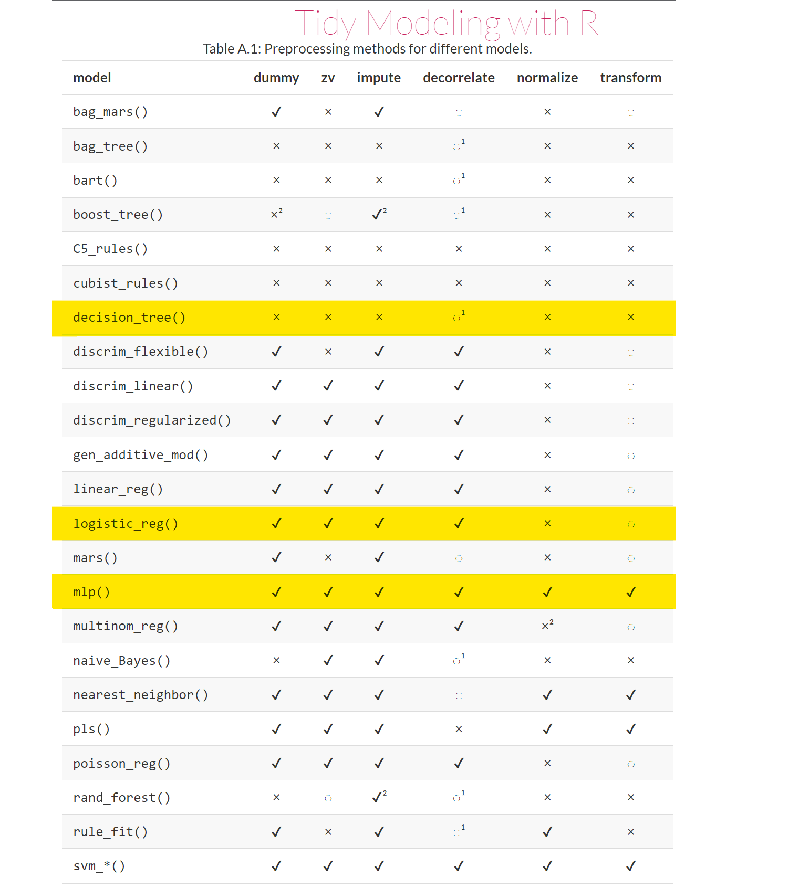

For the enhanced recipe some non-preprocessing steps were used to create a easier to comprehend dataset, such as creating credit account for negative payment balance payments, handling repayment status and difference between bill amount and payment. However with the low complexity model and neural network this extra step did not seem to help performance.

## Data

**Load Data**

```{r, warning=FALSE,message=FALSE}
library(dplyr)
library(forcats)
library(GGally)
data<-read.csv('default of credit card clients - adapted.csv')
data<-data%>%mutate_if(is.character, as.factor)
data <- data %>%
    mutate(is_default = fct_relevel(is_default, 'Yes'))

```

**Data description***:*

Number of rows: 30,000

Number of columns: 25

Predictors and Description

-   **General**

    -   `id`: ID of each client

    -   `limit_balance`: amount of given credit (includes individual and family/supplementary credit)

    -   `gender`: gender (male, female)

    -   `educ_level`: (graduate school, university, high school, others, unknown 1, unknown 2)

    -   `marital`: marital status (married, single, others)

    -   `age`: age in years

-   **Repayment status** (-2 = ?, -1 = pay duly, 0 = ?, 1 = payment delay for one month, 2 = payment delay for two months, ... 8 = payment delay for eight months, 9 = payment delay for nine months and above)

    -   `pay_0`: repayment status in September 2005

    -   `pay_2`: repayment status in August 2005

    -   `pay_3`: repayment status in July 2005

    -   `pay_4`: repayment status in June 2005

    -   `pay_5`: repayment status in May 2005

    -   `pay_6`: repayment status in April 2005

-   **Bill amount**

    -   `bill_amount1`: amount of bill statement in September 2005

    -   `bill_amount2`: amount of bill statement in August 2005

    -   `bill_amount3`: amount of bill statement in July 2005

    -   `bill_amount4`: amount of bill statement in June 2005

    -   `bill_amount5`: amount of bill statement in May 2005

    -   `bill_amount6`: amount of bill statement in April 2005

-   **Payment amount**

    -   `pay_amount1`: amount of previous payment in September 2005

    -   `pay_amount2`: amount of previous payment in August 2005

    -   `pay_amount3`: amount of previous payment in July 2005

    -   `pay_amount4`: amount of previous payment in June 2005

    -   `pay_amount5`: amount of previous payment in May 2005

    -   `pay_amount6`: amount of previous payment in April 2005

**Exploratory data analysis**

**Data quality:** total number of missing values in each data column can be seen as 0 below and there are also no duplicate

```{r}
sum(is.na(data))
sum(duplicated(data))
```

**Outcome**

```{r}
defaults<-data$is_default%>%summary()
defaults
```

**Summary Table (Distribution of Numerical Predictors)**

```{r, warning=FALSE,message=FALSE}
library(tidyr)
stat_overall <- data %>%
  select(-id,-gender,-educ_level,-marital)%>%
  pivot_longer(-is_default) %>%
    group_by(name)%>%
  summarise(min = min(value), 
            Q1 = quantile(value, 0.25),
            Median = median(value),
            Average = mean(value),
            Q3 = quantile(value, 0.75),
            Max = max(value),
            SD = sd(value),
            IQR = IQR(value))
stat_overall
```

**Distribution of Categorical Variables**

```{r, warning=FALSE,message=FALSE}
categorical<-data%>%select(gender,educ_level,marital)%>%summary()
categorical
```

**Correlation Matrix**

```{r, warning=FALSE,message=FALSE}
library(ggcorrplot)
data1<-data%>%mutate(is_default= ifelse(is_default=='Yes',1,0))
corr <- data1%>%select(-id,-gender,-educ_level,-marital)%>%cor()
ggcorrplot(corr)
```

**Categorical Predictor Relationship with Outcome**

```{r, warning=FALSE,message=FALSE}
gender <- data%>%select(is_default,gender)%>%group_by(is_default)%>%count(gender)
gender%>%ggplot(aes(x=is_default,y=n))+geom_bar(stat = "identity")+facet_grid(. ~ gender)
```

```{r, warning=FALSE,message=FALSE}
marital <- data%>%select(is_default,marital)%>%group_by(is_default)%>%count(marital)
marital%>%ggplot(aes(x=is_default,y=n))+geom_bar(stat = "identity")+facet_grid(. ~ marital)
```

```{r, warning=FALSE,message=FALSE}
educ <- data%>%select(is_default,educ_level)%>%group_by(is_default)%>%count(educ_level)
educ%>%ggplot(aes(x=is_default,y=n))+geom_bar(stat = "identity")+facet_grid(. ~ educ_level)
```

**Conclusion from EDA**

-   Default rate seems to be quite high at around 20%, maybe the issuance of cards should be stricter to reduce this number

-   Repayment Status (`pay_0` to `pay_6`) seem to be somewhat correlated with `is_default` seen through the correlation matrix

-   There seems to be more female customer than male. Male seems to have a higher default rate

-   A major group of customer are single and they also make up the highest default rate

-   Majority of customer are in some form of education/ has had some form of education as they are graduates. These 3 groups makes up most defaults

## Baseline Model (Logistic Regression)

This model was chosen based on it being easily explainable and the amount of time it takes to train. Logistic regression is one of the most common starting point for classification question it is similar to how linear regression is used for numeric/continuous variable but for non-continuous variable. It estimates a probability of how likely an event will happen (dependent variable) so it creates a curve that ranges from 0 to 1 on the y axis.

**Hyperparameters**

`penalty()` was the only hyperparameter that was tuned. The bigger the value the more penalized a variable becomes if it is not a good indicator for the outcome

`mixture = 1` was set due to the amount of variable that is provided in the dataset. When `mixture` is equal to 1 it removes any variable that is not a good predictor for the model and tries to simple down the model. This is also known as a lasso regression

**Preprocessing steps (Base Recipe)**

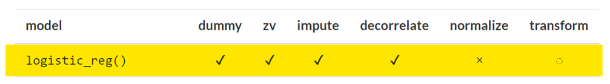

-   Dummy Variables on the categorical variables were created as the model could not interpret catergorical variables on its own

-   ZV looks to remove column with one unique value as it provides no value to the analysis if value remain constant

-   Imputation was skipped as the dataset had no missing data points as shown earlier

-   Decorrelation was done to ensure correlation between certain variables were mitigated and prevents them from taking over how the model predicts

**Results**

After the second tune the graph below was generated based on enhanced recipe

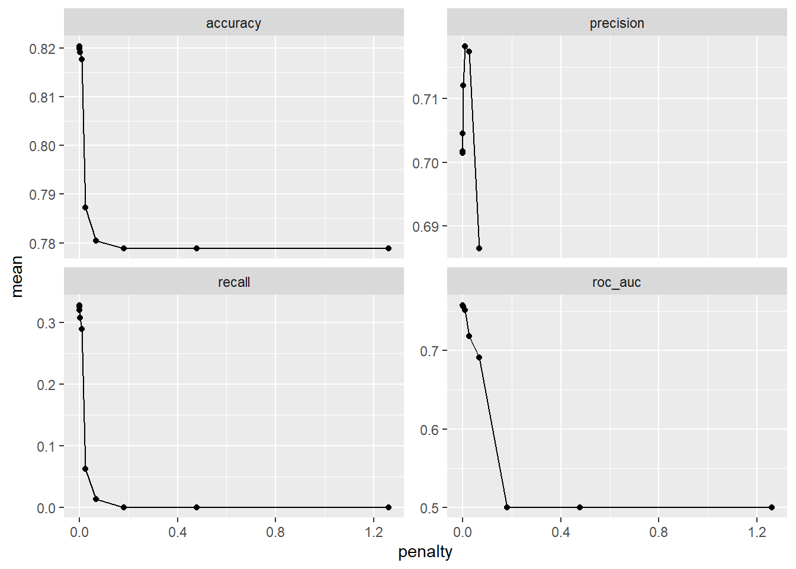

**Best combination of hyperparameters**

`penalty = 1 x e-10` generates a ROC_AUC of 0.758 using the enhanced recipe

## Low-complexity Model (Decision Tree)

This model was chosen based on it being easy to learn as. Decision Tree is often known to perform better than logistic regression in a classification question. It lays out all variables and looks at the probability of the outcome each variable has an impact on

**Hyperparameters**

`cost_complexity()` was the only hyperparameter that was tuned. The bigger the value the more level of trees were branched out to and the more complex the decison tree becomes

**Preprocessing steps (Base Recipe)**

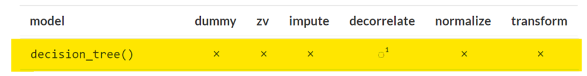

-   No steps were taken in the base recipe.

**Results**

After the second tune the graph below was generated based on base recipe

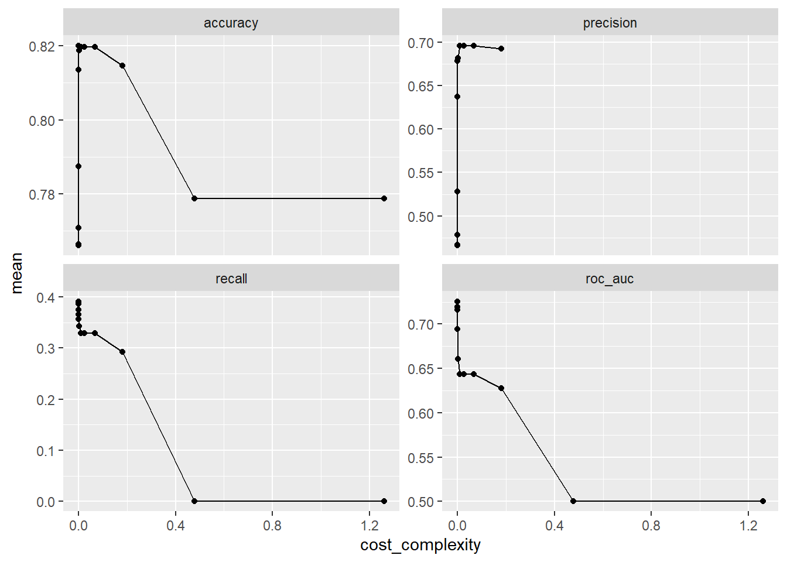

**Best combination of hyperparameters**

`cost_complexity = 5.41 x e-4` generates a ROC_AUC of 0.726 using the base recipe

## Best-performing Model (Neural Networks)

This model was chosen based on its performance. Neural Networks is able to learn non-linear data and make sense of it and works well in an environment where there are greater quantity of data point which fits the scenario we are in.

**Hyperparameters**

`hidden_units()` was one of the two hyperparameters tuned. It determines how many non-linear transformation are applied between the input and output.

`penalty()` was the other hyperparameter tuned. It looks to penalize the model when it is overfitted and the purpose of it is to keep the value low for better performance

**Preprocessing steps (Base Recipe)**

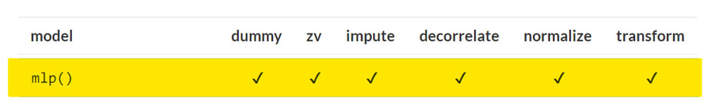

-   Dummy Variables on the categorical variables were created as the model could not interpret catergorical variables on its own

-   ZV looks to remove column with one unique value as it provides no value to the analysis if value remain constant

-   Imputation was skipped as the dataset had no missing data points as shown earlier

-   Decorrelation was done to ensure correlation between certain variables were mitigated and prevents them from taking over how the model predicts

-   Normalization was done to ensure that predictors were all at the same magnitude so the size wouldn't drastically the model

-   Transformation was done to ensure that predictors were normally distributed

**Results**

After the second tune the graph below was generated based on base recipe

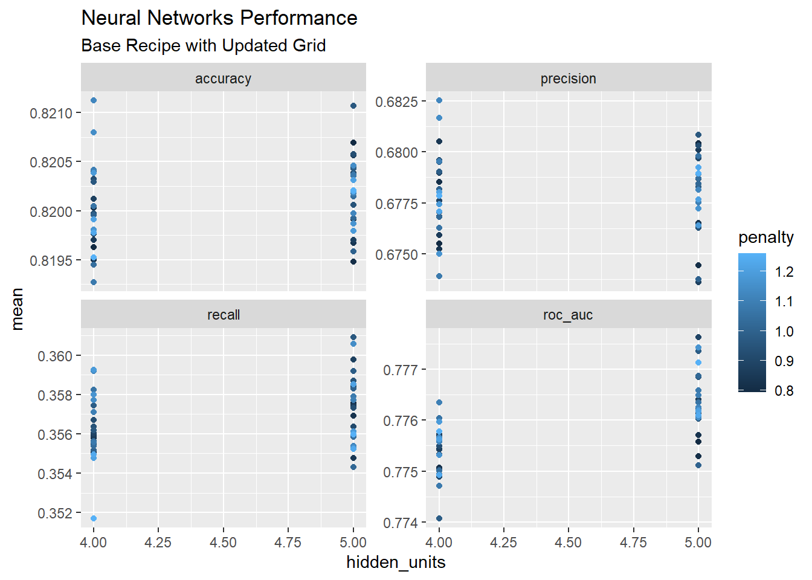

**Best combination of hyperparameters**

`hidden_units = 5` and `penalty = 0.891` generates a ROC_AUC of 0.778 using the base recipe

**Discussion**

The best performing model (neural network) compared to low-complexity (decision tree) performed \~0.05 better which is quite significant but when compared to the baseline of logistic regression it was only 0.02 which is still significant but it is very subjective as it depends on what key stakeholders think is consider a good model and how much ROC_AUC the historical models with similar data has generated.

The training time of the three model can be seen below. The difference in run time is significant and if key stakeholders are not concerned with \~0.02 then the baseline model would be the most ideal for usage as it can be computed the quickest while providing a decent perfromance

+--------------------------------+------------+------------------+------------+
| Model                          | Recipe     | Second           | ROC_AUC    |
+================================+============+==================+============+
| Logistic Regression (Baseline) | Enhanced   | \~300 second     | 0.758      |
+--------------------------------+------------+------------------+------------+
| Decision Tree (Low Complexity) | Base       | \~ 990.31 second | 0.726      |
+--------------------------------+------------+------------------+------------+
| Neural Network (Best)          | Base       | \~3087.43 second | 0.778      |
+--------------------------------+------------+------------------+------------+

**Test Results**

The metrics below were measured on the test data after using the entire training dataset to train the model

+--------------------------------+----------+----------+--------------------------------------------------------------------------------------------------------------------------------------------------------------------------------------+
| Model                          | ROC_AUC  | Accuracy | Horizontal Truth, Vertical Truth                                                                                                                                                     |
+================================+==========+==========+======================================================================================================================================================================================+
| Logistic Regression (Baseline) | 0.7534   | 0.8155   | +--------------------+-----------------------------------------------------------+--------------------------------------------------------------------------------------------+      |
|                                |          |          | |                    | **Y**                                                     | **N**                                                                                      |      |
|                                |          |          | +--------------------+-----------------------------------------------------------+--------------------------------------------------------------------------------------------+      |
|                                |          |          | | **Y**              | 519                                                       | 244                                                                                        |      |
|                                |          |          | +--------------------+-----------------------------------------------------------+--------------------------------------------------------------------------------------------+      |
|                                |          |          | | **N**              | 1140                                                      | 5597                                                                                       |      |
|                                |          |          | +--------------------+-----------------------------------------------------------+--------------------------------------------------------------------------------------------+      |
+--------------------------------+----------+----------+--------------------------------------------------------------------------------------------------------------------------------------------------------------------------------------+
| Decision Tree (Low Complexity) | 0.7373   | 0.8112   | +-------------------+----------------------------------------------------------+---------------------------------------------------------------------------------------------------+ |
|                                |          |          | |                   | **Y**                                                    | **N**                                                                                             | |
|                                |          |          | +-------------------+----------------------------------------------------------+---------------------------------------------------------------------------------------------------+ |
|                                |          |          | | **Y**             | 562                                                      | 319                                                                                               | |
|                                |          |          | +-------------------+----------------------------------------------------------+---------------------------------------------------------------------------------------------------+ |
|                                |          |          | | **N**             | 1097                                                     | 5522                                                                                              | |
|                                |          |          | +-------------------+----------------------------------------------------------+---------------------------------------------------------------------------------------------------+ |
+--------------------------------+----------+----------+--------------------------------------------------------------------------------------------------------------------------------------------------------------------------------------+
| Neural Network (Best)          | 0.7736   | 0.8177   | +---------------+-------------------------------------------------------------+----------------------------------------------------------------------------------------------------+ |
|                                |          |          | |               | **Y**                                                       | **N**                                                                                              | |
|                                |          |          | +---------------+-------------------------------------------------------------+----------------------------------------------------------------------------------------------------+ |
|                                |          |          | | **Y**         | 586                                                         | 294                                                                                                | |
|                                |          |          | +---------------+-------------------------------------------------------------+----------------------------------------------------------------------------------------------------+ |
|                                |          |          | | **N**         | 1073                                                        | 5547                                                                                               | |
|                                |          |          | +---------------+-------------------------------------------------------------+----------------------------------------------------------------------------------------------------+ |
+--------------------------------+----------+----------+--------------------------------------------------------------------------------------------------------------------------------------------------------------------------------------+

**ROC_AUC Curve (In order of Baseline -\> Low-Complexity -\> Best Performing)**

As shown in the table above the Neural Network (3rd graph) covers the most area under the curve as it has the highest ROC_AUC score. This shows once again neural network is indeed the best performing model

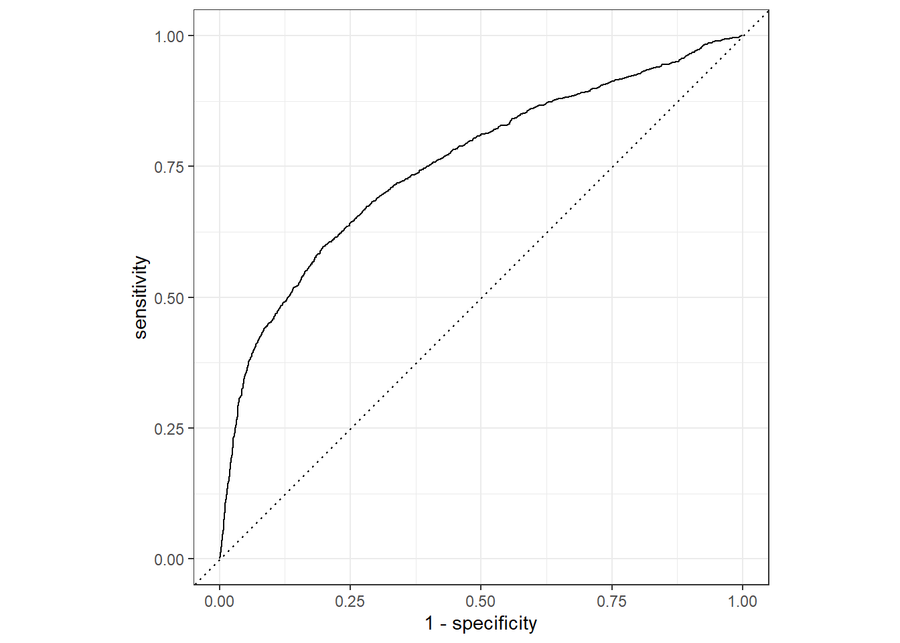{width="677"}

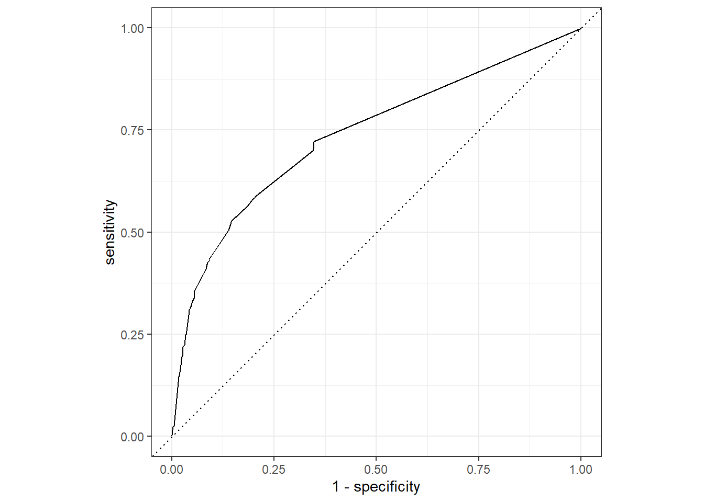{width="675"}

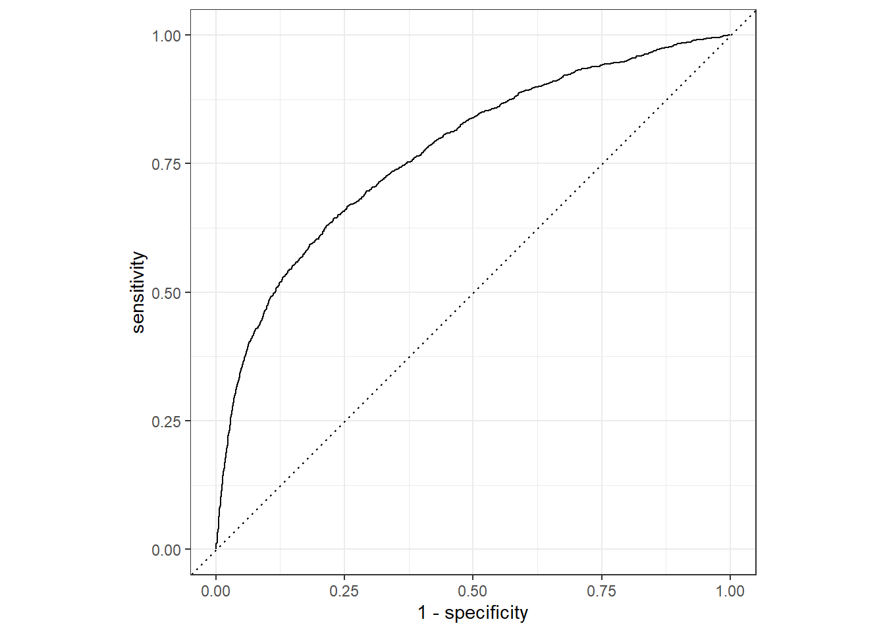{width="673"}

**Precision Recall Curve** **(In order of Baseline -\> Low-Complexity -\> Best Performing)**

Looking at the area under the curve it can be observed (3rd graph) has the most area under while the low-complexity model has the smallest area meaning it is the least accurate on a precision and recall basis while neural network is proven to still be the best model even using precision and recall.

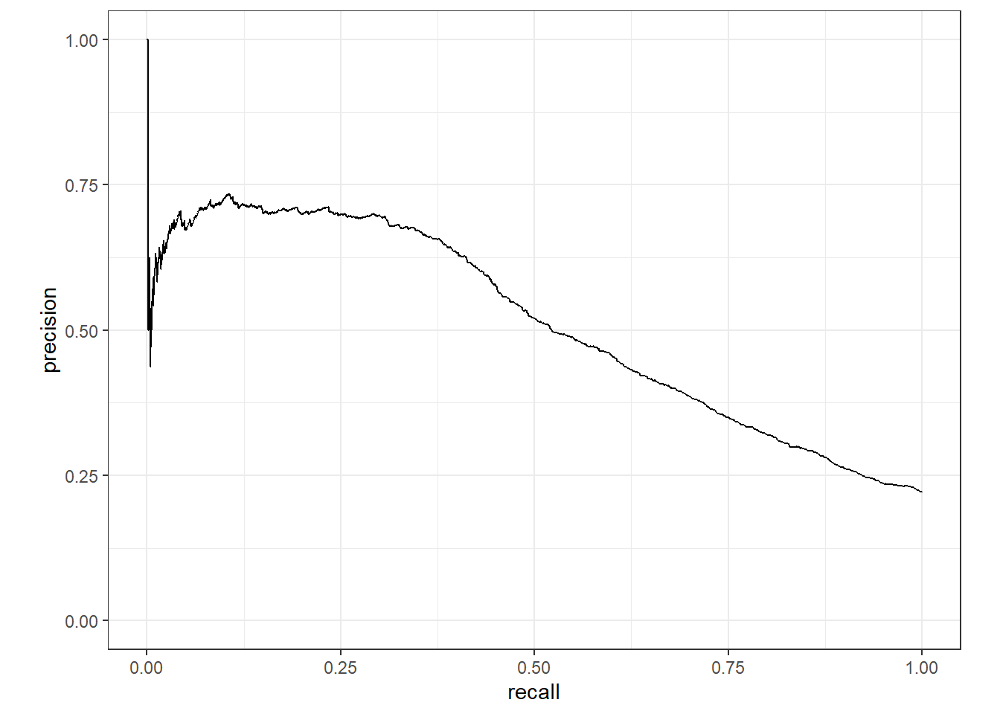{width="670"}

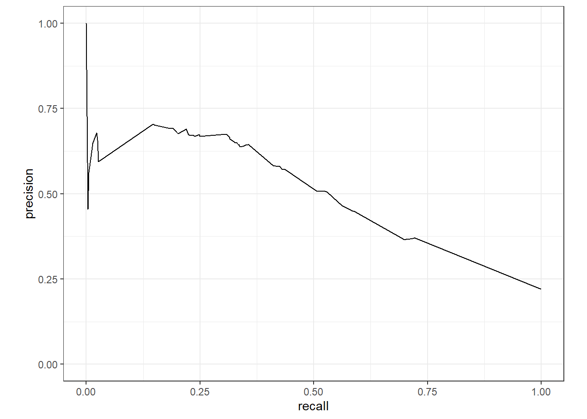{width="667"}

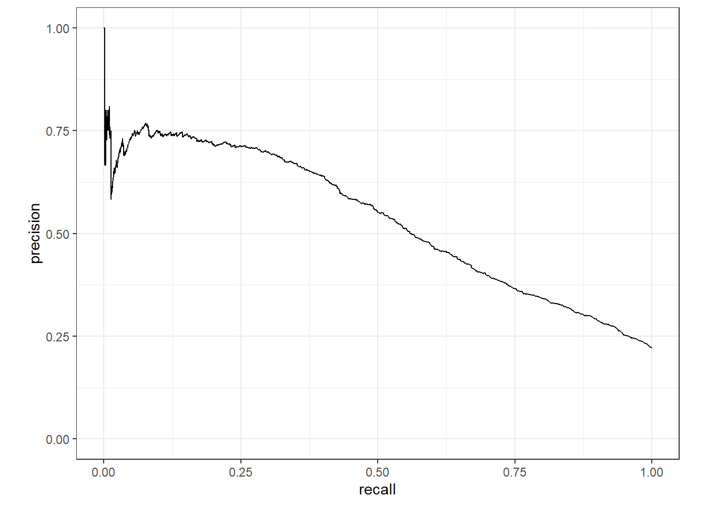{width="669"}

## Conclusion

From the analysis above is quite apparent that neural networks was the best model as it provides the best metric in AUC_ROC and also precision and recall trade-off. Despite its strong performance it also took the longest time to run out of all model, so a question for further discussion would be what the key stakeholder are looking for fast computation or best possible results.

The neural network model will be superior in circumstance where we have a large dataset as that is what it thrives at, finding patterns whether linear or non-linear within the data and make predictions that are quite accurate as seen in the precision and recall curve and the confusion matrix.

**Improvement Suggestion**

If more computing power was available it would be interesting to see what would happen if the amount of time repeated in the cross validation would have any changes that could affirm what has been discovered or challenge the current finding as over-fitting.

**Business Suggestion / Insight**

Looking at the recommended model it can be seen that the most important feature is `pay_amount2` which indicates the previous payment amount in August 2005 and at the time the data was collected it was October so `pay_amount2` represents the amount paid 2 month after purchase. This can be rationalized as if a customer is not going to pay their bill at 2 months then the chance of them doing so is only decrease later on. From the feature importance chart below it can also be see that education level is another predictor of importance as it is able to determine if the customer is capable of paying.

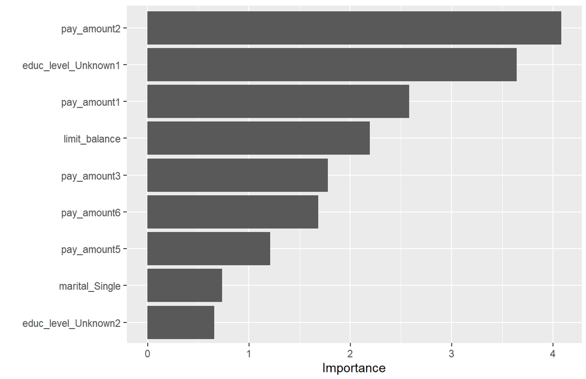
